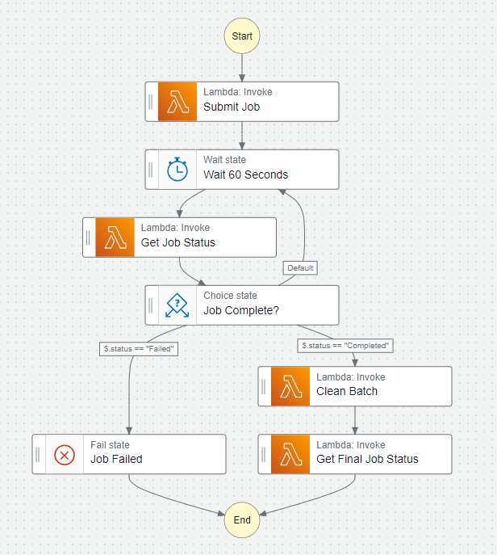

# GreenGuardian 🌎🛡️

Green Guardian is a deep learning object detection model achieving a mAP score of ~0.7, trained on images retrieved from Google's Open Images Dataset V7. Designed to contribute to a greener environment by accurately detecting and highlighting plastic objects within images. Leveraging optimal deep learning practices, data analysis techniques, and cloud-based infrastructure, this project aims to enable effective identification and monitoring of plastic presence, promoting environmental sustainability and conservation efforts.

## Key Features 📝

- **Deep Learning Object Detection**: Green Guardian employs advanced object detection techniques to accurately detect and locate plastic objects within images, providing valuable insights for environmental analysis.

- **Cloud Infrastructure**: Leveraging AWS cloud-based tools, Green Guardian ensures efficient processing, accessibility, and availability for users across different platforms. Also allows for scalability and cost-effectiveness with a main serverless architecture.

- **Batch Transformation Pipeline**: Green Guardian utilizes a batch transformation pipeline to process large quantities of images at once, ensuring efficiency and scalability. This pipeline is orchestrated by AWS Step Functions, which coordinates the execution of several serverless Lambda functions to ensure that the pipeline runs smoothly and efficiently.

- **Environmental Impact**: By highlighting and raising awareness about plastic presence, Green Guardian promotes conscious decision-making, waste reduction, recycling initiatives, and the preservation of ecosystems.

## Architecture 🏗️

The architecture of Green Guardian incorporates various cloud services to achieve efficiency and scalablity. Most of the services are managed by AWS, with the exception of Apache MXNet, which is an open-source deep learning framework (utilized for model training purposes). Overall, the architecture is designed to be serverless, allowing for cost-effectiveness and scalability.

- **AWS SageMaker**: Green Guardian utilizes SageMaker for model training, hyperparameter tuning, and inference. SageMaker provides a managed environment for developing and deploying machine learning models at scale, giving rise to efficient training and inference processes.

- **AWS Step Functions**: Step Functions is used to orchestrate the plastic detection pipeline. Gave me the opportunity to define a state machine that coordinates the execution of Lambda functions, ensuring that the pipeline runs smoothly and efficiently.

- **AWS EventBridge**: AWS EventBridge is utilized here to schedule and trigger the plastic detection pipeline at specific intervals using CRON jobs. Defined time schedules and events, ensuring that the detection pipeline runs at regular intervals to process newly submitted images.

- **AWS Lambda**:  Lambda functions were used to asynchronously create/manage batch transform jobs for inference (and allow for interactions with AWS S3), allowing for a scalable and cost-effective inference process.

- **AWS S3**: S3 buckets were used to store all things data! From model artifacts to training data to modified batch outputs, S3 buckets were used to store and manage all data related to the project.

- **Apache MXNet**: Utilized this open-source deep learning framework to preprocess and create RecordIO files for training and inference. This RecordIO format is compatible with SageMaker's object detection tasks, allowing for efficient training and inference processes.

## Pipeline 🚀

The Green Guardian pipeline is orchestrated by AWS Step Functions, which coordinates the execution of several serverless Lambda functions to ensure that the pipeline runs smoothly and efficiently. During production, the pipeline is triggered by a CRON job, which is defined using AWS EventBridge. This CRON job ensures that the pipeline runs at regular intervals to process newly submitted images once daily. Below is a flowchart that illustrates the design-ideas behind the pipeline:

  

### Pipeline Video
Delve deeper into the mechanics of the pipeline through this concise video. Instead of a superficial overview of a button press, I present a manual invocation to elucidate the process. In practical deployment, I've set-it up so that a CRON job triggers the pipeline daily, with batch transformations taking approximately 10 minutes to complete. The video is intentionally sped up for brevity, offering a clear insight into the pipeline's functionality.

https://github.com/akkik04/GreenGuardian/assets/81925146/cadf5c6e-95c4-45df-b8de-53daec1132b2

Driving more clarity into the pipeline, the process is as follows (for you high-level overview folks):

1. **Initiation of Batch Transform Job**: The pipeline kicks off with the precision of a scheduled CRON job, orchestrated through AWS EventBridge. This ensures a daily execution rhythm, handling newly submitted images seamlessly. The process unfolds with the creation of a batch transform job, initiated by a Lambda function invoked via AWS Step Functions. To emulate the daily CRON job trigger showcased in the video, random images (images that the model has not been trained on) are uploaded to the `input-images` S3 bucket, marking the beginning of the pipeline's journey.

2. **Monitoring Batch Transform Job Progress**: With efficiency being the core of this project, the pipeline tracks the batch transform job status at 60-second intervals. A dedicated Lambda function ensures a seamless flow, withholding progression until the job completes successfully. This crucial monitoring guarantees a flawless transition to the subsequent phases.

3. **Retrieval and Optimization of Model Output**:  
    * The model's prowess comes to life as it conducts object detection on the batch of images. Following this, the pipeline swiftly retrieves the output—.json files containing confidence scores and detection coordinates for each image. This retrieval is managed by a Lambda function, depositing the valuable output in the `batch-output` S3 bucket.

    * Simultaneously, the same Lambda function optimizes the output, parsing it down to essential information. This streamlined version is stored in the `modified-outputs`` S3 bucket, easing subsequent processes and conserving storage space.

    * Transitioning beyond the Lambda function, a productionized SageMaker notebook was used (depicted this as a lambda func in the code, its called `draw-inference-results-func.py`) draws bounding boxes on the images using the modified output. The results, the inferenced images, find their home in the inferenced-images S3 bucket, marking the completion of this pivotal phase. I haven't included the actual productionized notebook in this repo due to privacy concerns.

4. **Validation of Batch Transform Job Success**: Finally, the pipeline examines the batch transform job's status to ensure a seamless journey. Managed by a Lambda function, any successful completion results in a flawless termination, paving the way for users to access their images adorned with expertly drawn bounding boxes (images viewable in the `inferenced-images` S3 bucket). In a production setting, this image repository will seamlessly integrate with a MySQL database, offering users a web app interface for image exploration. The day's mission accomplished with finesse and accuracy!
